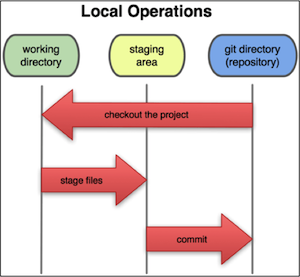
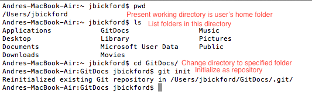
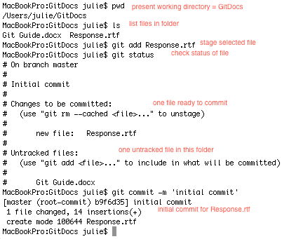
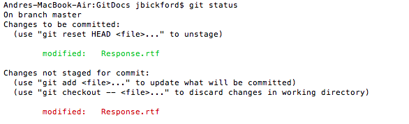
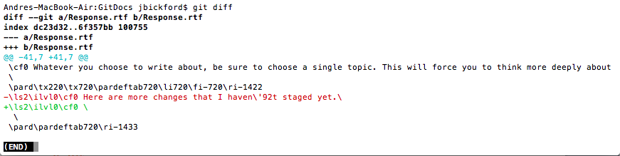
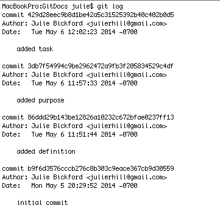

##The Git Guide for Mac Users
_Easy-to-follow instructions for using the version control system_

by Julie Bickford

###Overview

#####What is Git?

Git is a tool that allows you to keep track of multiple versions of a project. At any point in modifying the file, you can use Git to view earlier versions, view changes made along the way, and even revert to one of those earlier versions. Let’s say you’ve created a résumé that you’ve organized chronologically, but you’re thinking about using a skills-based organization instead. You could create a second file, copy the information from the original file and paste it into the new file, then save the file under a name like “Skills-based Resume.docx.” This can become tedious and, more than likely, you’ll end up with several files with inconsistent naming patterns, and a poorly organized workstation. 

Instead of creating new files, you can simply “commit” (or save) the file to Git at certain milestones. Once you’ve committed the résumé that is organized chronologically, feel free to add or delete text and move sections around. If you don’t like the new pattern, use Git to revert to the previous version. 

Git works with virtually any file type. For more sophisticated files, i.e. those that offer complicated formatting options and the ability to insert media, Git isn’t able to specify the exact changes made from one version to the next, but it can still log the file’s development over time. The program is relatively easy to install and use on your Mac computer. 

#####Who can use Git?

Git was created in 2005 by Linus Torvalds, the same man who created the Linux operating system, and is mostly used by software engineers. It can be just as useful for non-technical users, however. Some people who could benefit from Git are professionals writing reports, graduate students writing dissertations, authors writing books, and members of a group collaborating on a publication (Git also allows multiple users to modify a single file, keeping track of each user’s contributions and logging each version separately—more on this feature later). 

Teachers often collaborate and could benefit from Git as well. Those who teach at the same grade level create curriculum plans together, outlining the goals, lessons, and assignments they will use to help students meet prescribed standards. Usually, one teacher creates a document on his computer, adds content, then saves it and sends it off as an email attachment. The other teachers download the document, add their changes, then save it individually and, once again, email it as an attachment. They now have four or five different versions of a file that will need to be consolidated and edited, taking up yet more precious time. Git can help streamline this process and save time.

###Using Git

#####Terminal

Before getting into Git, you will need to know a few things about using your computer’s terminal, as the Git application runs through the terminal. Terminal is located in the Utilities folder, inside the Applications folder. A faster way to access Terminal is to use Spotlight, your computer’s search tool. _See figure 1.1._


Below is a key for common commands and shortcuts used in Terminal (these will make more sense to you after you’ve started using Git).

* **pwd** = _present working directory_

* **ls** = _list contents in the directory_

* **cd** = _change the working directory_

* **control-c** = _cancel previous command_ (maybe you misspelled a word so the command didn't work)

* **up arrow** = _enter previous command_ (continue clicking the up arrow until the desired command is displayed)

#####Download, Install, and Setup

The program is available on [Git’s website](http://git-scm.com/downloads). After following the instructions for downloading and installing the program on your computer, open Terminal and customize your settings for Git: 

1. Your username

   	**git config --global user.name [John Doe]**

2. Your email address:

   	**git config --global user.email [jdoe@somewhere.com]**
	
3. The editor, or the application you may use when typing messages in Git:

	**git config --global core.editor [name]**
	
	*At times, you will have to compose brief messages for Git. You may find a plain text editor helpful for these instances. There are a few applications that work in conjunction with Terminal: Pico, emacs, vi, and nano. Though they are all very similar to one another, nano may be the most user-friendly and is the text editor of choice for this tutorial.
	
To check that you’ve correctly entered your settings, use the command **git config –list**. 
 
For a reference list of commands, simply type **git help**.

The final step for setting up Git will take place in your Finder window. You will need to create a folder that will house the documents you plan to use with Git. It’s most convenient to store this folder in your home folder. When naming folders and files, try to limit the name to 1-2 words. Omit spaces in between words if possible: the shorter the name, the more quickly you can type commands. Lastly, Git commands are case sensitive, so using all lower-case names might save time as well.

#####The Stages of a Project

A project will go through a basic three-step process in Git. It may be easier to understand this process by starting with the final stage, where Git takes a snapshot of the file in its current state and “commits” (or saves) that version to its directory. This is the _commit_ stage. Prior to this step, you have made changes to a file and “staged” it, i.e. told Git that you’re getting ready to save a new version of the file. This is the _staged area_. Before staging a file, however, you must enter it into your working directory so that Git becomes aware of the file you are working with. _See figure 1.2._

 

#####Basic Git Commands

You’ll start by telling Git which folder contains the document you will be modifying. Git refers to this folder as the “repository.” This is the folder that you created in your home folder during the setup process. In Terminal, change the directory to this folder by using the following command:

**cd [folder name]**

Now, tell Git this is the folder where you are _initializing a repository_:

**git init**

_See figure 1.3._


You can check that you’ve correctly set up the repository by asking the terminal for the _present working directory_ (**pwd**). You can also ask it to list the files contained in the repository (**ls**).

To stage a file, use the _add_ command:

**git add [file name]**

After staging the file, always check the status to make sure there haven’t been any changes made to it since staging it:

**git status** 

After checking the status, you can then commit the version to Git. Every commit requires a message, or reason, for the commit. This message should offer a brief description of its current state, or the milestone you’ve reached, and you can word it however you like. For example, “initial commit,” “added new section,” and so on.

**git commit –m "[message]"**		

_See figure 1.4._

 


**Helpful tip:**

* Rather than typing the full name of a file, use this shortcut:

		First letter, Tab

  Git will automatically complete the file name for you.

		e.g. "G, Tab" --> "GitDocs"

Now you can resume working on your project. When you reach the next milestone, follow the same process to save a new version: git add, git status, git commit.

#####More Complex Commands for Tracking a Project
Git gives you several options besides simply tracking, staging, and committing files.

######_Ignore files in your repository_
You might have files saved in your repository that you do not want Git to track (i.e. keep showing up when you type “git status”). This requires creating a “hidden” file first. Programs on your computer automatically create files that store data. These files are not intended for the user to open, and therefore remain hidden when the user views files in Finder. 

1. **nano .gitignore**
2. **type** the name(s) of the file(s) Git will ignore (accuracy matters!)
3. **save** changes and **exit** nano
4. **git status** will tell you that you have one untracked file: .gitignore
5. **git add .gitignore**
6.  **git commit -m "[message]"**

Now, when you type git status, you should see only the file(s) that Git is tracking. To modify .gitignore, simply open it in the text editor and add/delete file names, then add and commit those changes to Git.

######_View staged versus unstaged changes_

Let’s say you’ve modified a project then staged the changes in Git. Then, you get sidetracked and take a phone call, grab some coffee, then come back to your work station and continue modifying your project. YOu When you type git status, you’ll see something like this:

This informs you that you’ve made changes to the project since last staging it. To see exactly what changes you made since it was last staged, type

**git diff**

Git will show you the changes that were made since the last stage. Minus signs (-) indicate what was deleted, while plus signs (+) indicate what was added. _See figure 1.6_

While you likely won’t need git diff for tracking a single project, it does help when you’re working on multiple projects at the same time. In this scenario, Git will show you which files have been staged for commit, and which have been modified but not yet staged. More on this in the next section.

To see the difference between the staged version of a project and its _last commit_, type
**git diff --staged**

*If you modify a project after staging it, you’ll need to stage it again before committing, otherwise you’ll lose the any changes that were saved to it since the earlier stage. 

######_Unstage a file after you've already staged it_

Perhaps you’ve staged the file before realizing there is something else you wanted to modify; or, you’re working with multiple files and you staged them at the same time, but realized you need to unstage one:

**git reset HEAD [file name]**

######_Remove a file that you mistakenly told Git to track, while keeping it on your hard drive_

Maybe you overlooked this file when running the ignore command, and now need to unstage and remove from working directory: 

**git rm –cached [file name]**

######_Remove a file from your working directory AND your hard drive_

* **rm [file name]**
* **git status**
* **git rm [file name]**
* **git commit –a**

######_Changing your last commit_

It’s easy to fix mistakes made when committing a version. Maybe you committed a version before adding a required section, or maybe you messed up the commit message:

**git commit –amend**

Your previous commit message will open in the text editor. If you edit the message, the previous commit message will be overwritten.  

######_Reverting to an earlier version_

At some point in your work flow, you might decide that you don’t like the changes you’ve made since the last commit and want to revert to the previous version of your project. To do this, begin with git status, then

**git checkout -- [file]**

#####Viewing Previous Versions

After you’ve modified and saved several versions of your project, you may decide that you want to view a history of all the commits you’ve made. To do this, type

**git log**

As you can see in the figure below, Git generates a list of all of the commits you’ve done in reverse chronological order. For the Response.rtf example, there were four versions committed to the repository. Perhaps your project has eight versions thus far, but you only see the first four. Terminal only shows you one page of commits at a time. To view the next page of commits, press **space**. To return to the command line, type the letter **q**.

######What do you want to know about the previous versions?

There are several commands that allow you to obtain different kinds of information when viewing the commit history. 

######_Viewing differences between versions_

You've already learned **git diff**, the command used to see what changes have been made to the project since its last commit. If you'd like to see the differences between each commit, type

**git log -p**

This command will show you line-by-line differences, which is more helpful for people writing code. If you're working on a presentation, dissertation, or some other lengthy text project, you'll want to use a slightly different command:

**git log -p --word-diff**

As suggested by the command, this will show you the word differences between versions.

######_Limiting the output_

Suppose you have committed many versions of your project and you don't want to see all of them. Following "git log," add the number of commits you want to see with a dash preceding the number:

**git log -3**

This command can be combined with other commands you are making, for instance:

**git log -p --word-diff -3**

######_Make it pretty_

Tired of trying to make sense of the lengthy outputs for each commit? Use the following command to condense the information you need to know into one line for each commit:

**git log --pretty=oneline**

There are plenty of other commands for obtaining the exact information you want to know about each commit, but those listed above are the most common commands a single user may need. If you're tracking a complex project in Git over a long period of time, you might benefit from some of those other commands, which you can find on [Git's website](http://git-scm.com/book/en/Git-Basics-Viewing-the-Commit-History).
